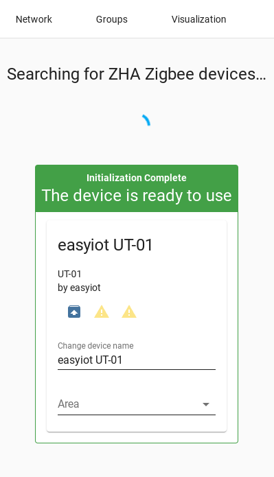

# esphome-zb-gw03


[](https://www.buymeacoffee.com/syssi)

ESPHome custom firmware for ZB-GW03 eWeLink Ethernet Zigbee Gateway.

## Compatible hardware

ZB-GW03 Zigbee to LAN bridge/gateway based on Espressif ESP32 and a Silicon Labs EFR32MG21 Zigbee radio (CoolKit-Technologies "SM-011 V1.0" module).

### Supported devices

* ZB-GW03 eWeLink Ethernet Zigbee Gateway (ZB-GW03-V1.0, ZB-GW03-V1.2, ZB-GW03-V1.3), also sold rebranded as:
  * Eachen eWeLink ZigBee Smart Hub
    * https://ewelink.eachen.cc/product/eachen-ewelink-zigbee-bridge-pro-zbbridge-pro/
    * https://ewelinkcommunity.net/device-lists/zigbee/eachen-zb-gw03/
  * SmartWise Zigbee Bridge Pro
    * https://www.okosabbotthon.hu/smartwise-zigbee-bridge-pro

## Requirements

* [ESPHome 2021.10.0 or higher](https://github.com/esphome/esphome/releases).

## Installation

Use the `coordinator-example.yaml` as proof of concept:

```bash
# Install esphome
pip3 install esphome

# Clone this external component
git clone https://github.com/syssi/esphome-zb-gw03.git
cd esphome-zb-gw03

# Validate the configuration, create a binary, upload it, and start logs
esphome run coordinator-example.yaml
```

## Flash the Zigbee module via telnet

This step is required only if the Zigbee module (SM-011 V1.0, EFR32MG21) wasn't flashed via Tasmota.

```bash
apt-get install lrzsz
wget https://github.com/arendst/Tasmota/raw/development/tools/fw_SonoffZigbeeBridge_ezsp/ncp-uart-sw_6.7.8_115200.ota

# Turn "download mode" switch ON
# Toggle "zigbee reset" switch
# Turn "download mode" switch OFF
# Shutdown Home Assistant (we are trying to avoid multiple cnnections to the stream_server)

telnet 192.168.132.230 6638

# Press return
# Press 1 (upload gbl)
# Close the telnet connection
# Upload the new firmware
sx -vv -X -b --tcp-client 192.168.132.230:6638 ncp-uart-sw_6.7.8_115200.ota
```

Additional (yet untested) firmware versions: 

* https://github.com/xsp1989/zigbeeFirmware/tree/master/firmware/ZigbeeBridge_SM-011
* https://github.com/xsp1989/zigbeeFirmware/tree/master/firmware/Zigbee3.0_Dongle/EZSP
* https://github.com/xsp1989/zigbeeFirmware/tree/master/firmware/Zigbee3.0_Dongle/RouterForDongle

## How to convert the router into a coordinator

##### 1. Make sure Home Assistant (ZHA) doesn't use the device as coordinator.

##### 2. Flash the `router-example.yaml` to your ZB-GW03

```
esphome run router-example.yaml
```

#### 3. Install the xmodem file transfer tool lrzsz

```
apt-get install lrzsz
```

#### 4. Download the router firmware image

```
wget https://github.com/digiblur/Tasmota/raw/development/zigbee_router/efr32mg21_zigbee_router_signed-6.7.10.gbl.ota
```

#### 5. Boot the Zigbee module into the download mode
  - Turn on the `Download Mode` switch entity via Home Assistant
  - Turn on the `Zigbee Reset` switch entity via Home Assistant (goes to "off" automatically)
  - Turn off the `Download Mode`

#### 6. Telnet to the bootloader of the Zigbee module and select "upload gbl"
  - `telnet 192.168.132.230 6638`
  - Press `return`
  - Press `1` and `return` to select "upload gbl"

```
$ telnet 192.168.132.230 6638
Trying 192.168.132.230...
Connected to 192.168.132.230.
Escape character is '^]'.

Gecko Bootloader v1.9.1.04
1. upload gbl
2. run
3. ebl info
BL >
Gecko Bootloader v1.9.1.04
1. upload gbl
2. run
3. ebl info
BL > 1

begin upload
```

#### 7. Goto a second terminal and upload the new firmware. You don't need to cancel the telnet session.

```
$ sx -vv -X -b --tcp-client 192.168.132.230:6638 efr32mg21_zigbee_router_signed-6.7.10.gbl.ota
connecting to [192.168.132.230] <6638>

Sending efr32mg21_zigbee_router_signed-6.7.10.gbl.ota, 1843 blocks: Give your local XMODEM receive command now.
Bytes Sent: 236032   BPS:3556

Transfer complete
```

#### 8. Restart the Zigbee module via Home Asisstant or Reboot the whole device
  - Press the `Zigbee Reset` switch or `Restart` switch

#### 9. Enable the "Pairing Mode"
  - Goto the ESPHome device in Home Assistant and turn the "Enable Pairing Mode" switch on

#### 10. The Router can be paired now with your Zigbee Coordinator. If you use ZHA goto your Zigbee Coordinator Device and press "Add device".



## Known issues

None.

## References

* https://templates.blakadder.com/ewelink_ZB-GW03
* https://github.com/arendst/Tasmota/discussions/12764
* https://github.com/tube0013/tube_gateways
* https://github.com/thegroove/esphome-zbbridge
* https://github.com/oxan/esphome-stream-server
* [https://github.com/CoolKit-Technologies/DevDocs/blob/master/Zigbee/SM-011应用指导书.md](https://github.com/CoolKit-Technologies/DevDocs/blob/master/Zigbee/SM-011%E5%BA%94%E7%94%A8%E6%8C%87%E5%AF%BC%E4%B9%A6.md)
  * https://github.com/zigpy/zigpy/discussions/586
* [https://community.home-assistant.io/t/zb-gw03-ewelink-ethernet-zigbee-gateway...](https://community.home-assistant.io/t/zb-gw03-ewelink-ethernet-zigbee-gateway-now-hacked-with-tasmota-zbbridge-so-can-be-used-via-mqtt-or-as-a-remote-zigbee-adapter-with-home-assistant-zha/341223)
