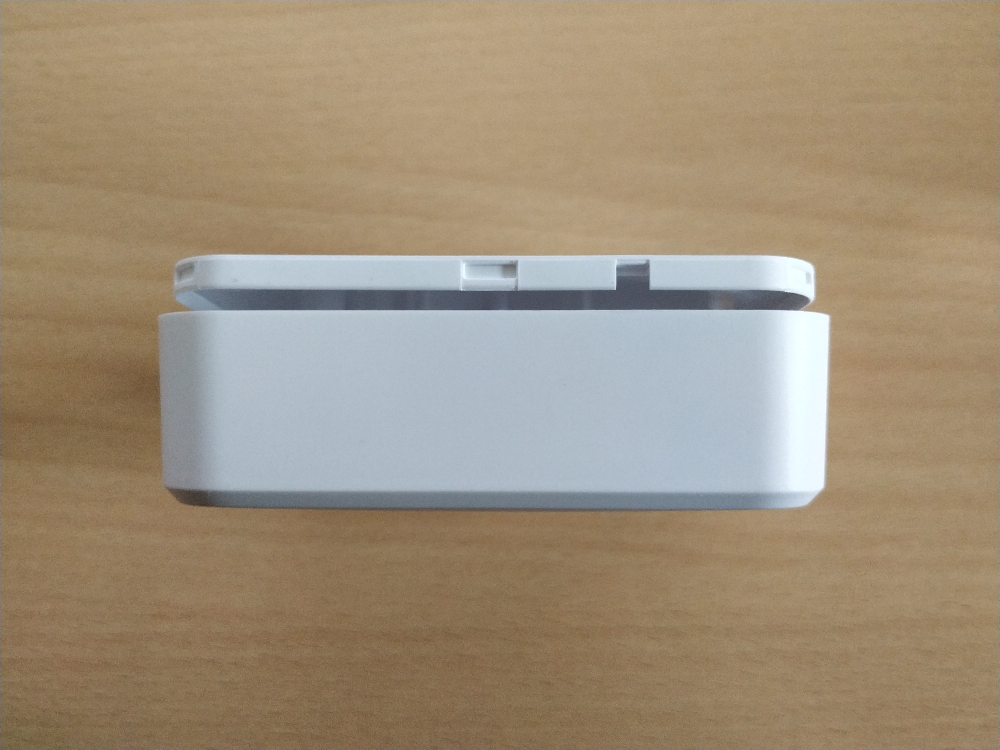
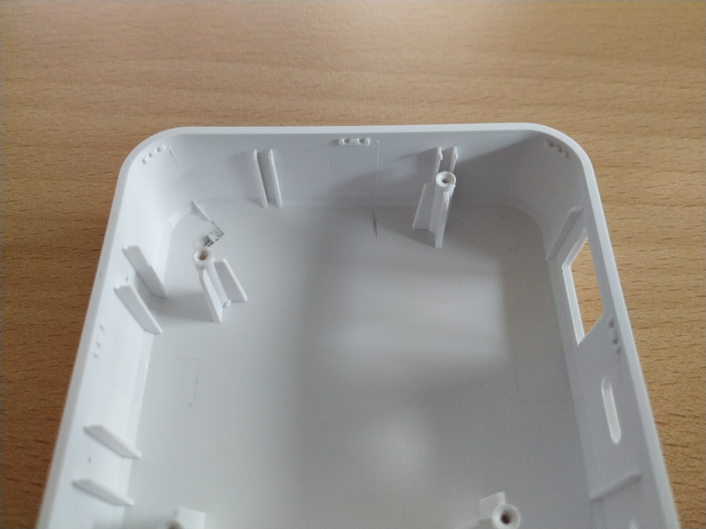
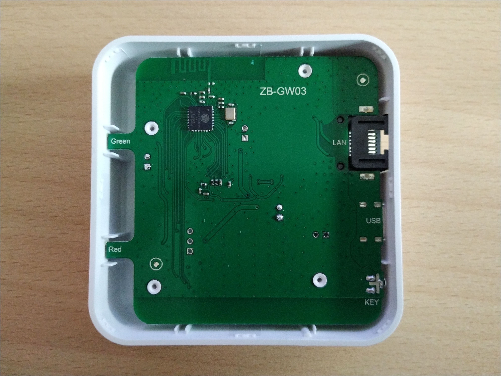
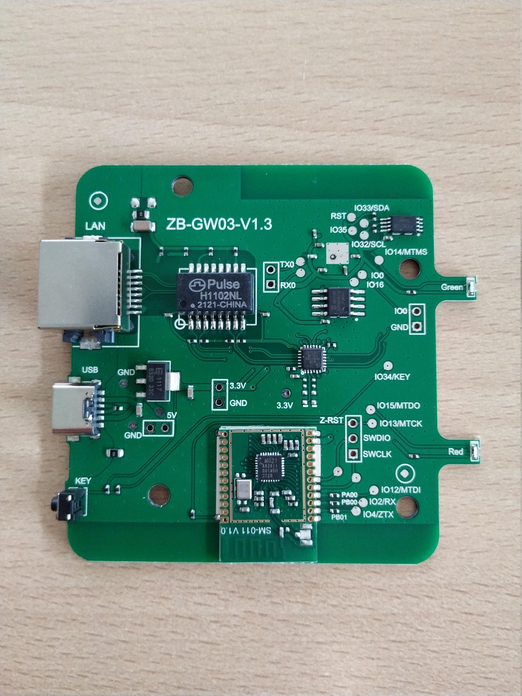
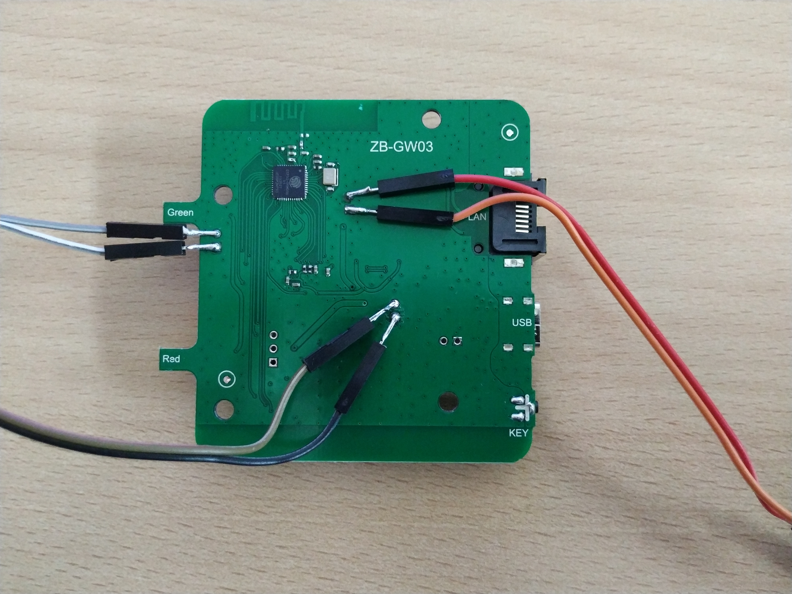
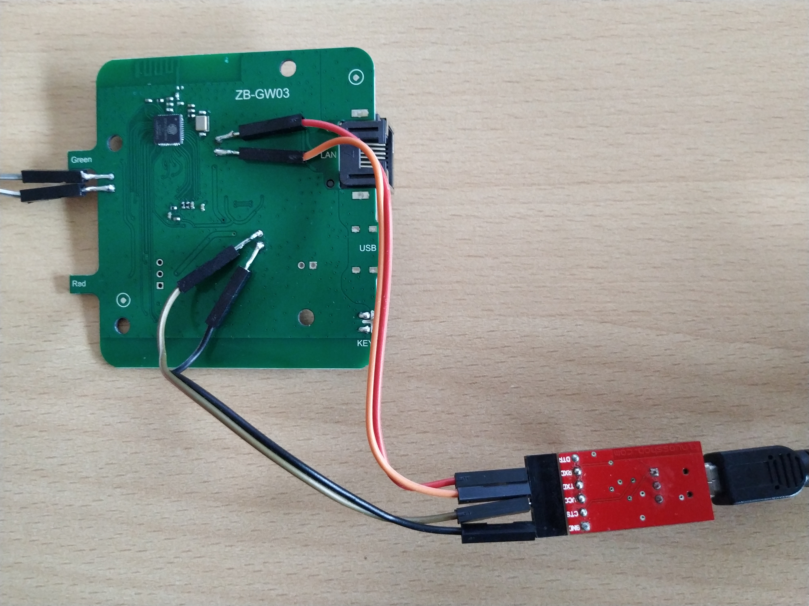
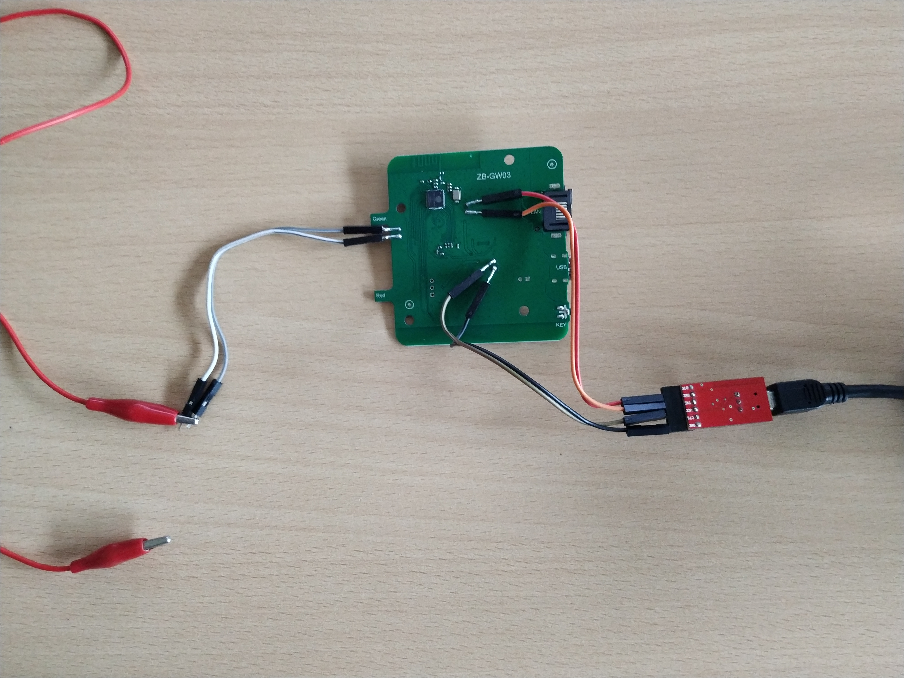

# Flashing guide

Table of contents:
* [Warning](#warning)
* [Tools needed](#tools-needed)
* [Opening the device, to expose the PCB](#opening-the-case-to-expose-the-pcb)
* [Solder wires to the board](#solder-wires-to-the-board)
* [Connect the wires to your serial to USB adapter](#connect-the-wires-to-your-serial-to-usb-adapter)
* [Make a backup of the current firmware](#make-a-backup-of-the-current-firmware)
* [How to restore the backed up firmware](#how-to-restore-the-backed-up-firmware)
* [Flash new ESPHome firmware](#flash-esphome-firmware)
* [Flash the ZigBee module](#flash-the-zigbee-module)
* [Troubleshooting flash](#troubleshooting-flash)

## Warning

We have writen these instructions with care, but we will give absolutely no warranty. Perhaps you
will destroy your lamp and your computer.

## Tools needed

* Something flat f.e. a guitar clip to open the case
* Soldering Iron
* A serial to USB adapter (for example FTDI) that can provide 3.3V RX/TX signals
* Some wires


## Opening the case, to expose the PCB

*Tip: you can click on all images from below to view them in full size.*

Detach the bottom lid from the rest of the device, exposing the PCB. This might take a bit of force. Just pull it off bit by bit, until it pops loose.






## Solder wires to the board

The wires will be connected to the debug pads that are shown in the following image. Solder the wires to the `RX`, `TX`, `GND`, `3.3V` and `GPIO0` debug pads.



## Connect the wires to your serial to USB adapter

Make sure that your adapter uses 3.3V for the RX/TX pins that you will connect to the device. Some of
these adapters allow you to switch between 3.3V and 5V using a switch or a jumper. Do not use an
adapter that only provides 5V output. Reason for this, is that the ESP32 chip works at 3.3V. I have
seen the chips accept 5V serial input (I did flash the lamp successfully like that), but I am not
sure if they are actually 5V tolerant. Better safe than sorry in such case!

The wires must be connected as follows:

  | Soldering point| Serial USB Adapter name  |
  | -------------- |:------------------------:|
  | GND            |  GND                     |
  | TX             |  RX                      |
  | RX             |  TX                      |
  | 3.3V           |  3.3V                    |

To be able to flash the device, `GPIO0` must be connected to ground (`GND`) while the device boots up.
Flashing will *not* work if you connect these wires *after* the device has already been booted up.
In the following images, you will see one solution, using male dupont wires.



You can now connect the serial to USB adapter to your computer. Pay special attention to the
cross-over of the TX/RX pair (TX connects to RX and vice versa).



Because `GPIO0` is connected to `GND`, the device should start up in download mode.

## Make a backup of the current firmware

Backing up the firmware makes it possible to revert to the original firmware, in case you have
problems with the ESPHome firmware. The backup can be created using "esptool". Installation
instructures can be found here:

  https://github.com/espressif/esptool/blob/master/README.md#installation--dependencies

Here's an example on how to backup the original firmware by the esptool read_flash command:

```
$ python esptool.py -p /dev/ttyUSB0 read_flash 0x0 0x400000 oem-firmware.bin
esptool.py v3.2
Serial port /dev/ttyUSB0
Connecting......
Detecting chip type... Unsupported detection protocol, switching and trying again...
Connecting...
Detecting chip type... ESP32
Chip is ESP32-D0WDQ6-V3 (revision 3)
Features: WiFi, BT, Dual Core, 240MHz, VRef calibration in efuse, Coding Scheme None
Crystal is 40MHz
MAC: 94:b9:7e:d3:fc:64
Uploading stub...
Running stub...
Stub running...
4194304 (100 %)
4194304 (100 %)
Read 4194304 bytes at 0x0 in 392.6 seconds (85.5 kbit/s)...
Hard resetting via RTS pin...
```

`/dev/ttyUSB0` is the port of the USB adaper on Linux. You can find what port is used by the adapter
by running `dmesg` after plugging in the USB device. On Windows this is often `COM1`, `COM2` or
`COM3`.

## How to restore the backed up firmware

In case you need to rollback to the gateway's original firmware at some point, here's an example of how
to restore the original firmware, by fully flashing it back onto the device.

First, bring the device into the download mode (`GPIO0` is connected to `GND`), then start the esptool write_flash command:

```
python esptool.py -p /dev/ttyUSB0 write_flash 0x0 oem-firmware.bin
```

Be patient after the upload reaches 100%. The output is silent while esptool tool is verifying that
the firmware was uploaded correctly.

## Flash ESPHome firmware

Setup an ESPHome Project (see [README.md](../README.md)), compile the firmware for the gateway and
flash the firmware to the device:

```
$ esphome run coordinator-example.yaml
INFO Reading configuration coordinator-example.yaml...
WARNING GPIO4 is a Strapping PIN and should be avoided.
Attaching external pullup/down resistors to strapping pins can cause unexpected failures.
See https://esphome.io/guides/faq.html#why-am-i-getting-a-warning-about-strapping-pins
WARNING GPIO2 is a Strapping PIN and should be avoided.
Attaching external pullup/down resistors to strapping pins can cause unexpected failures.
See https://esphome.io/guides/faq.html#why-am-i-getting-a-warning-about-strapping-pins
WARNING GPIO15 is a Strapping PIN and should be avoided.
Attaching external pullup/down resistors to strapping pins can cause unexpected failures.
See https://esphome.io/guides/faq.html#why-am-i-getting-a-warning-about-strapping-pins
INFO Generating C++ source...
INFO Compiling app...
Processing example (board: esp-wrover-kit; framework: arduino; platform: platformio/espressif32 @ 3.3.2)
--------------------------------------------------------------------------------------------------------------------------------------------------------------------------
HARDWARE: ESP32 240MHz, 320KB RAM, 4MB Flash
LDF: Library Dependency Finder -> https://bit.ly/configure-pio-ldf
Dependency Graph
|-- <AsyncTCP-esphome> 1.2.2
|-- <WiFi> 1.0
|-- <Update> 1.0
|-- <Wire> 1.0.1
|-- <ESPmDNS> 1.0
Compiling .pioenvs/example/src/main.cpp.o
Linking .pioenvs/example/firmware.elf
RAM:   [=         ]  12.9% (used 42344 bytes from 327680 bytes)
Flash: [=====     ]  47.8% (used 876550 bytes from 1835008 bytes)
Building .pioenvs/example/firmware.bin
====================================================================== [SUCCESS] Took 6.93 seconds ======================================================================
INFO Successfully compiled program.
Found multiple options, please choose one:
  [1] /dev/ttyUSB0 (FT232R USB UART - FT232R USB UART)
  [2] Over The Air (example.local)
(number): 1
esptool.py v3.2
Serial port /dev/ttyUSB0
Connecting.....
Chip is ESP32-D0WDQ6-V3 (revision 3)
Features: WiFi, BT, Dual Core, 240MHz, VRef calibration in efuse, Coding Scheme None
Crystal is 40MHz
MAC: 94:b9:7e:d3:fc:64
Uploading stub...
Running stub...
Stub running...
Changing baud rate to 460800
Changed.
Configuring flash size...
Auto-detected Flash size: 4MB
Flash will be erased from 0x00010000 to 0x000e6fff...
Flash will be erased from 0x00001000 to 0x00005fff...
Flash will be erased from 0x00008000 to 0x00008fff...
Flash will be erased from 0x0000e000 to 0x0000ffff...
Compressed 876656 bytes to 495708...
Wrote 876656 bytes (495708 compressed) at 0x00010000 in 12.4 seconds (effective 567.3 kbit/s)...
Hash of data verified.
Compressed 17104 bytes to 11191...
Wrote 17104 bytes (11191 compressed) at 0x00001000 in 0.6 seconds (effective 219.5 kbit/s)...
Hash of data verified.
Compressed 3072 bytes to 144...
Wrote 3072 bytes (144 compressed) at 0x00008000 in 0.1 seconds (effective 307.7 kbit/s)...
Hash of data verified.
Compressed 8192 bytes to 47...
Wrote 8192 bytes (47 compressed) at 0x0000e000 in 0.1 seconds (effective 455.4 kbit/s)...
Hash of data verified.

Leaving...
Hard resetting via RTS pin...
INFO Successfully uploaded program.
INFO Starting log output from /dev/ttyUSB0 with baud rate 115200
```

From here on, it is possible to flash the device OTA (over the air, which means that the firmware is
uploaded over WiFi) from ESPHome. Therefore, it is now time to tuck away or remove those soldered
wires.

## Add the ESPHome node to Home Assistant

* Add the ESPHome integration
* As soon the new ESPHome device is online it should be discovered automatically
* Goto the integration page and configure the new ESPHome device
* The new device plus some entites are available now

## Flash the Zigbee module

Turn "download mode" switch ON and toggle "zigbee reset" switch once.

```
$ telnet 192.168.132.225 6638
Trying 192.168.132.225...
Connected to 192.168.132.225.
Escape character is '^]'.


Gecko Bootloader v1.9.1.04
1. upload gbl
2. run
3. ebl info
BL >
Gecko Bootloader v1.9.1.04
1. upload gbl
2. run
3. ebl info
BL > 1

begin upload
C^]
telnet> quit
Connection closed.
$
$ sx -vv -X -b --tcp-client 192.168.132.225:6638 ncp-uart-sw_6.7.8_115200.ota
connecting to [192.168.132.225] <6638>

Sending ncp-uart-sw_6.7.8_115200.ota, 1490 blocks: Give your local XMODEM receive command now.
Bytes Sent: 190848   BPS:3841

Transfer complete
$
```

Turn "download mode" switch OFF and toggle "zigbee reset" again. The Zigbee module will boot into the new firmware now.

## Connect the device to the ZHA integration of Home Assistant

* Goto the integration page of Home Assistant
* Use the "Add integration" button
* Search for "ZHA" (Zigbee Home Automation)
* Choose "Enter Manually" at the serial port selection dialog
* Choose "EZSP" as type of your Zigbee radio
* The serial device path is `socket://esphome_node_name.local:6638` (f.e. `socket://zb-gw03.local:6638` if you use the `coordinator-example.yaml`). Enter `115200` baud as port speed and the "data flow control" is `software`
