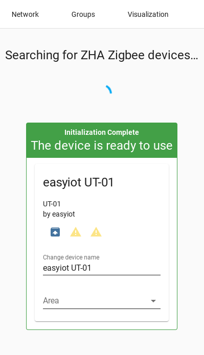

# How to convert the router into a coordinator


[](https://www.buymeacoffee.com/syssi)

#### 1. Make sure Home Assistant (ZHA) doesn't use the device as coordinator

#### 2. Flash the `router-example.yaml` to your ZB-GW03

```shell
esphome run router-example.yaml
```

#### 3. Install the xmodem file transfer tool lrzsz

```sh
apt-get install lrzsz
```

#### 4. Download the Zigbee router firmware image

```shell
wget https://github.com/digiblur/Tasmota/raw/development/zigbee_router/efr32mg21_zigbee_router_signed-6.7.10.gbl.ota
```

#### 5. Boot the Zigbee module into the download mode

  - Turn on the `Download Mode` switch entity via Home Assistant
  - Turn on the `Zigbee Reset` switch entity via Home Assistant (goes to "off" automatically)
  - Turn off the `Download Mode`

#### 6. Telnet to the bootloader of the Zigbee module and select "upload gbl"

  - `telnet 192.168.132.230 6638`
  - Press `return`
  - Press `1` and `return` to select "upload gbl"

```shell
$ telnet 192.168.132.230 6638
Trying 192.168.132.230...
Connected to 192.168.132.230.
Escape character is '^]'.

Gecko Bootloader v1.9.1.04
1. upload gbl
2. run
3. ebl info
BL >
Gecko Bootloader v1.9.1.04
1. upload gbl
2. run
3. ebl info
BL > 1

begin upload
```

#### 7. Goto a second terminal and upload the new firmware. You don't need to cancel the telnet session

```shell
$ sx -vv -X -b --tcp-client 192.168.132.230:6638 efr32mg21_zigbee_router_signed-6.7.10.gbl.ota
connecting to [192.168.132.230] <6638>

Sending efr32mg21_zigbee_router_signed-6.7.10.gbl.ota, 1843 blocks: Give your local XMODEM receive command now.
Bytes Sent: 236032   BPS:3556

Transfer complete
```

#### 8. Restart the Zigbee module via Home Asisstant or Reboot the whole device
  - Press the `Zigbee Reset` switch or `Restart` switch

#### 9. Enable the "Pairing Mode"
  - Goto the ESPHome device in Home Assistant and turn the "Enable Pairing Mode" switch on

#### 10. The Router can be paired now with your Zigbee Coordinator

If you use ZHA go to your Zigbee Coordinator Device and press "Add device".


